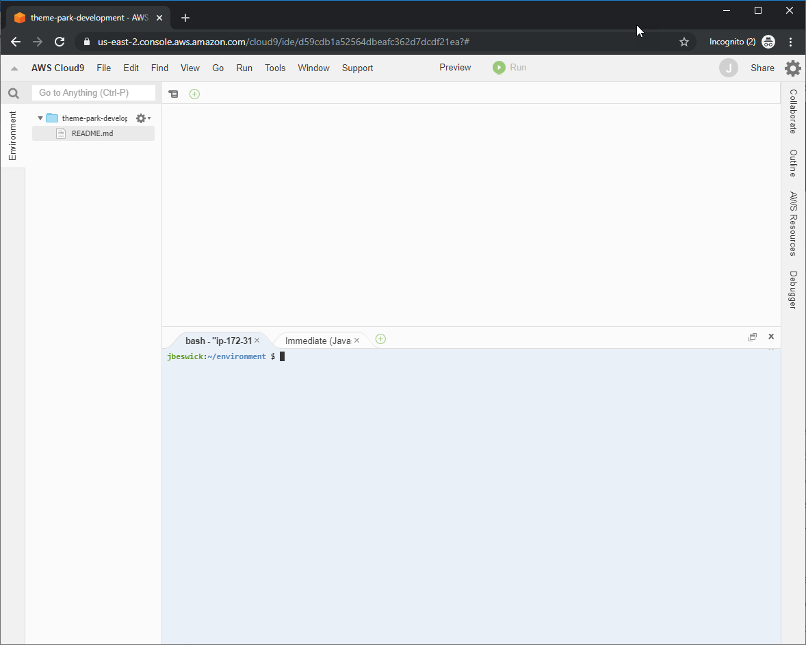
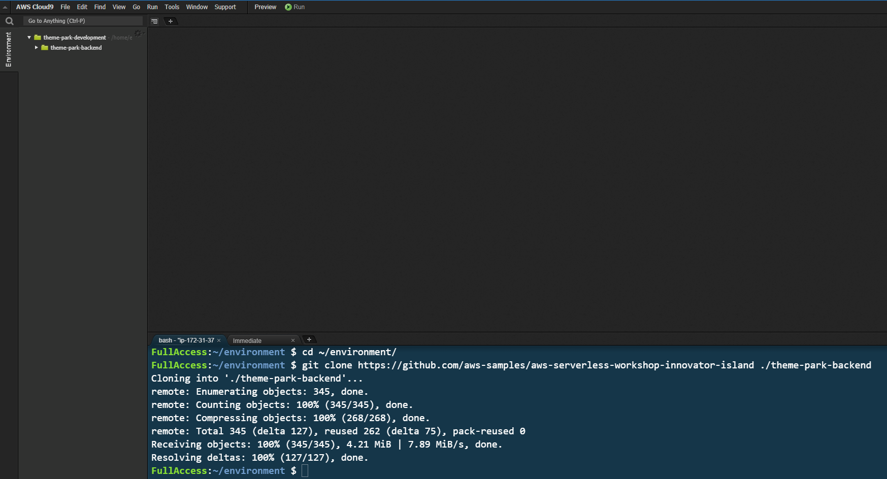
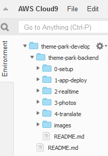

# Module 0: Initial Setup

### AWS Account

To complete this workshop, you will need an AWS account and access to create AWS resources within that account.

If you are doing this workshop as part of an AWS event, an account will be provided, you will not need to use an existing account or create a new one.

If you do need to use your own account, use a personal account or create a new AWS account for this workshop rather than using an organization's account to ensure you have full access to the necessary services and you do not leave behind any resources from the workshop.

The code and instructions in this workshop assume only one participant is using an AWS account at a time. If you attempt to share an account with another participant, you will encounter naming conflicts for certain resources. 

**:star: If required, [create a new AWS account here](https://portal.aws.amazon.com/gp/aws/developer/registration/index.html).**

### Region selection

Use a single region for the entirety of this workshop. This workshop only supports the following regions:

- us-west-2 (US West - Oregon)
- us-east-2 (US East - Ohio)
- us-east-1 (US East - Northern Virginia)

### AWS Cloud9 IDE

AWS Cloud9 is a cloud-based integrated development environment (IDE) that lets you write, run, and debug your code with just a browser. It includes a code editor, debugger, and terminal. Cloud9 comes pre-packaged with essential tools for popular programming languages and the AWS Command Line Interface (CLI) pre-installed so you don’t need to install files or configure your laptop for this workshop. Your Cloud9 environment will have access to the same AWS resources as the user with which you logged into the AWS Management Console. We strongly recommend using Cloud9 to complete this workshop.

Take a few minutes now and setup your Cloud9 development environment. Cloud9 works best with Chrome or Firefox, not Safari. It cannot be used from a tablet.

**:white_check_mark: Step-by-step Instructions**

1. Go to the AWS Management Console, Select **Services** then select **Cloud9** under Developer Tools. From the top-right of the Console, select an available region for this workshop. Once you have selected a region for Cloud9, use the same region for the entirety of this workshop.

1. Select **Create environment**.

1. Enter `theme-park-development` into **Name** and optionally provide a **Description**.

1. Select **Next step**.

1. You may leave **Environment settings** at their defaults for launching a new **t2.micro** EC2 instance bason on Amazon Linux which will be paused after **30 minutes** of inactivity. Select **Next step**.

1. Review the environment settings and select **Create environment**. It will take a few minutes for your Cloud9 environment to be provisioned and prepared.

1. Once ready, your IDE will open to a welcome screen. Below that, you should see a terminal prompt. Close the *Welcome* tab and drag up the terminal window to give yourself more space to work in. 



You can run AWS CLI commands in here just like you would on your local computer. Remember for this workshop to run all commands within the Cloud9 terminal window rather than on your local computer.

Keep your AWS Cloud9 IDE opened in a browser tab throughout this workshop.

Verify that your user is logged in by running the command `aws sts get-caller-identity`. Copy and paste the command into the Cloud9 terminal window. 

```console
aws sts get-caller-identity
```

You'll see output indicating your account and user information:

```json
ec2-user:~/environment $ aws sts get-caller-identity
{
    "Account": "123456789012",
    "UserId": "AKIAI44QH8DHBEXAMPLE",
    "Arn": "arn:aws:iam::123456789012:user/Alice"
}
```
Clone the repo which will download a local copy of the instructions and code you will use to build the backend portion of the workshop. Run these commands in the Cloud9 terminal window:

```console
cd ~/environment/
git clone https://github.com/aws-samples/aws-serverless-workshop-innovator-island
```



Within the Cloud9 file browser on the left hand side you can see the backend files have been downloaded.



Next, install JQ to provide formatting for JSON in the console:
```
sudo yum install jq -y
```

Finally, update the tools and software in your Cloud9 instance with these commands:
```
cd ~/environment/theme-park-backend/0-setup/
chmod 744 bootstrap.sh   
./bootstrap.sh
```

The update will take around 5 minutes to complete. Feel free to keep reading ahead while this finishes.

### :star: Tips

:bulb: Keep an open scratch pad in Cloud9 or a text editor on your local computer for notes. When the step-by-step directions tell you to note something such as
an ID or Amazon Resource Name (ARN), copy and paste that into your scratch pad.

### :star: Recap

:key: Use a unique AWS provided, personal or development [AWS account](#aws-account)

:key: Use the same region you selected when deploying [AWS Cloud9 IDE](#aws-cloud9-ide) for the entirety of this workshop.

:key: Keep your [AWS Cloud9 IDE](#aws-cloud9-ide) opened in a tab

### Next steps

:white_check_mark: Proceed to the first module, [1-Deploy the App][1-app-deploy], where you'll start building the initial application.

[region-table]: https://aws.amazon.com/about-aws/global-infrastructure/regional-product-services/
[static-web-hosting]: ../1-frontend/
[1-app-deploy]: ../1-app-deploy/
