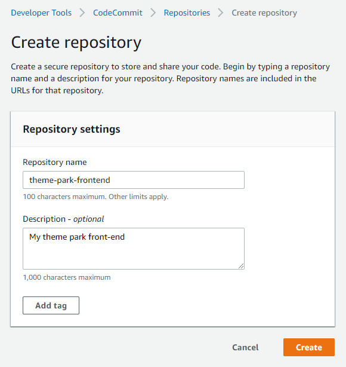
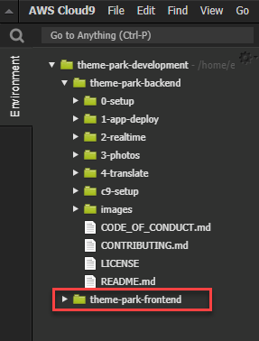
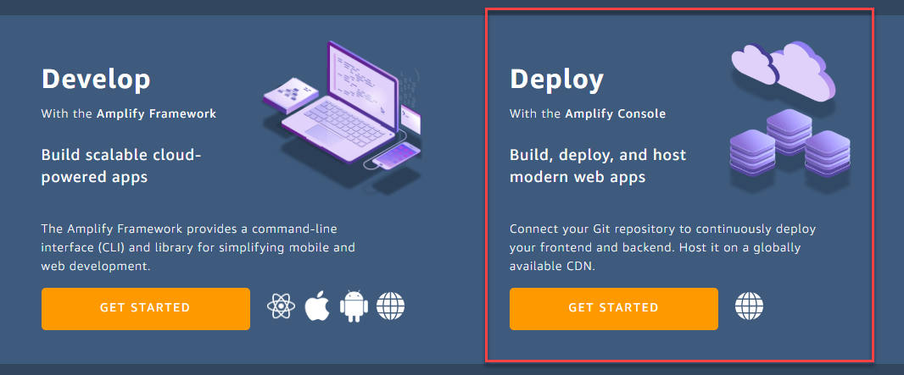
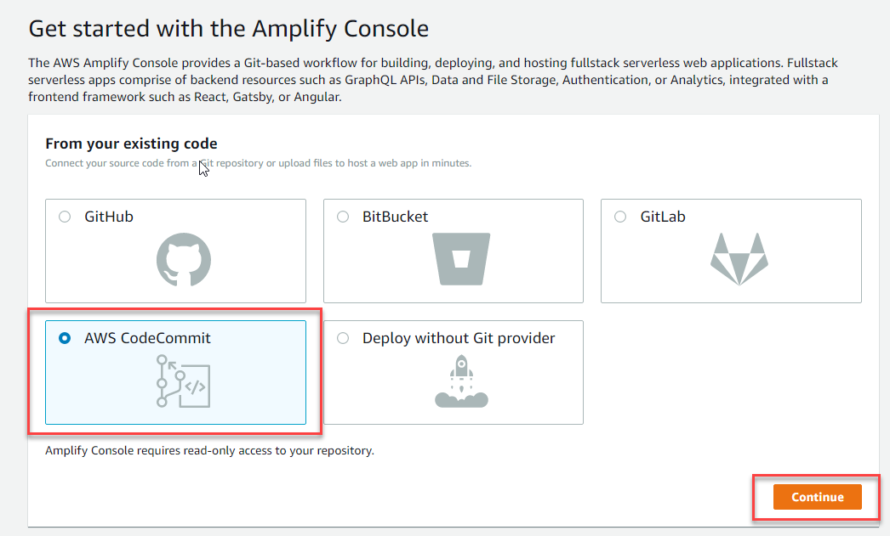
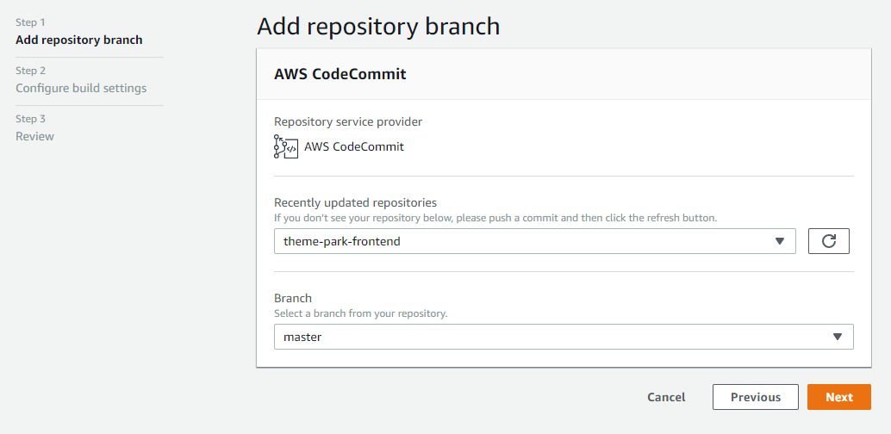
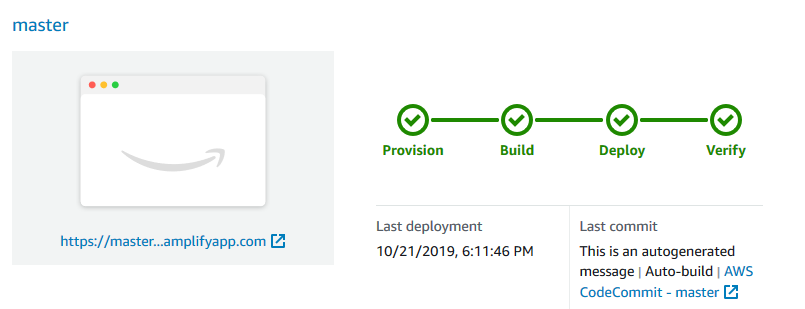
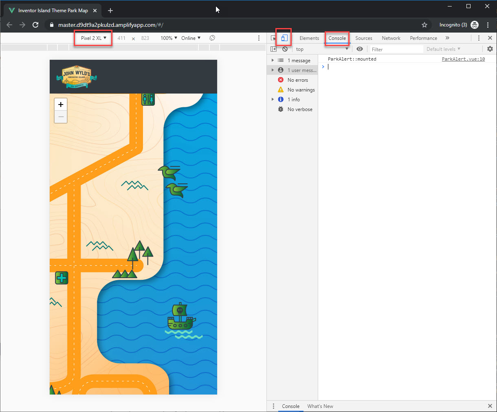

# Module 1: Deploy the frontend and backend applications 

## Overview

The theme park application consists of a frontend and backend - in this module, you will set up the frontend and then connect it to the backend.

The frontend is a [Progressive Web App](https://en.wikipedia.org/wiki/Progressive_web_applications) (PWA) developed in [Vue.js](https://vuejs.org/).

The frontend code is provided so you will only need to download the code and deploy into your own Git-based code repository stored in CodeCommit. Using [AWS Amplify Console](https://aws.amazon.com/amplify/console/), you will create a continuous deployment pipeline to publish your frontend application.

The backend is a set of serverless microservices. In this section we will set up the following:

* A DynamoDB table containing information about all the rides and attractions throughout the park.
* A Lambda function which performs a table scan on the DynamoDB to return all the items.
* An API Gateway API which creates a public http endpoint for the front-end application to query. This invokes the Lambda function to return a list of rides and attractions.

Once you have built the back-end resources needed, you will update the front-end application configuration to query the API Gateway endpoint and display the information about all the rides and attractions.

Each of the following sections provides an implementation overview and detailed, step-by-step instructions. Remember: if you have any questions, contact one of the AWS employees located around the room.

:heavy_exclamation_mark: Please ensure you have completed the [Setup Guide](https://github.com/aws-samples/aws-serverless-workshop-innovator-island/tree/master/0-setup) first!

## How it works - Frontend

* You will create a code repository in [AWS CodeCommit](https://aws.amazon.com/codecommit/).
* You will download the existing frontend code into your Cloud9 IDE and push the code to this repository.
* You will configure Amplify Console to connect to your repository and publish the web app.

After this section, you will be able to see the published web app on both your PC and mobile device by visiting the published URL.

## The Serverless Frontend


* All of your static web content including HTML, CSS, JavaScript, images and other files will be managed by AWS Amplify Console and served via Amazon CloudFront.
* Your end users will then access your site using the public website URL exposed by AWS Amplify Console. You don't need to run any web servers or use other services in order to make your site available.

*More information on the services introduced in this section:*
* [AWS Cloud9](https://aws.amazon.com/cloud9/)
* [AWS CodeCommit](https://aws.amazon.com/codecommit/)
* [AWS Amplify Console](https://aws.amazon.com/amplify/console/)

## Deploy the frontend infrastructure

**:white_check_mark: Step-by-step Instructions**

### 1. Create the repository

1. Go to the [AWS Management Console](https://console.aws.amazon.com/), click **Services** then select **CodeCommit** under *Developer Tools.*

#### :star: Make sure your region is set to the same region you initially selected for Cloud9.

2. Select **Create Repository**.
3. Set the *Repository name* to "theme-park-frontend".
4. Select **Create**.



You will see when the CodeCommit repository is successfully created.


### 2. Clone the code base

Once your CodeCommit git repository is created, you'll need to pull in the existing files for your frontend app from GitHub and sync to your new CodeCommit repository.

1. Go back to your browser tab with Cloud9 running. If you need to re-launch Cloud9, from the AWS Management Console, select **Services** then select **Cloud9** under *Developer Tools*.

#### :star: Make sure your region is set to the same region you initially selected for Cloud9.

2. The AWS Cloud9 development environment comes with AWS managed temporary credentials that are associated with your IAM user. You use these credentials with the AWS CLI credential helper. Enable the credential helper by running the following two commands in the terminal of your Cloud9 environment.

```
git config --global credential.helper '!aws codecommit credential-helper $@'
git config --global credential.UseHttpPath true
```

3. Now execute the following command to download the frontend code from GitHub into a separate local subdirectory from the backend instructions and code:
```
mkdir ~/environment/theme-park-frontend
cd ~/environment/theme-park-frontend
wget https://innovator-island.s3-us-west-2.amazonaws.com/front-end/theme-park-frontend.zip
unzip theme-park-frontend.zip 
```
Within the Cloud9 file browser on the left hand side you can see the theme-park-frontend files have been downloaded into a separate local directory from the theme-park-backend.



4. Push the downloaded code to populate your recently created CodeCommit repository:
```
cd ~/environment/theme-park-frontend/
AWS_REGION=$(curl -s http://169.254.169.254/latest/meta-data/placement/availability-zone | sed 's/\(.*\)[a-z]/\1/')
git push --set-upstream https://git-codecommit.$AWS_REGION.amazonaws.com/v1/repos/theme-park-frontend master

```


### 3. Deploy the site with the AWS Amplify Console.

Next you'll use the AWS Amplify Console to deploy the frontend website you've just committed to the CodeCommit git repository. The Amplify Console takes care of the work of setting up a place to store your static web application code and provides a number of helpful capabilities to simplify both the lifecycle of that application as well as enable best practices.

**:white_check_mark: Step-by-step Instructions**

1. Launch the [Amplify Console](https://console.aws.amazon.com/amplify/home).
2. Scroll down to the *Deploy* section and select **Get Started**.

3. Under *Get started with the Amplify Console*, select **AWS CodeCommit** and select **Continue**.



4. Select *theme-park-frontend* under **Recently updated repositories**, then choose *master* under **Branch**. Select **Next**.



5. On the *Configure Build settings* page, leave the defaults, scroll down and select **Next**.

6. On the *Review* page, verify the settings and select **Save and deploy**.

The deployment process will take a few minutes to complete. Once the build has a completed the **Verify** stage, select the Amplify provided link for your app. 



This will open the published URL in your browser. You will see the empty park map with a navigation bar. At the moment, there is very little functionality in the application but we will add those features next.

Copy the published URL of your web app into your scratch pad. You will need this throughout the subsequent modules.

You can also open the URL on your mobile device. This PWA is designed for mobile, so the responsive layout will adjust for different device sizes.

Once you have tested the public URL on a browser and a mobile device, you can start to build the backend.

## 4. Viewing the deployed web app

After Amplify Console has deployed the app, open the published URL in the Google Chrome or Mozilla Firefox browser.

1. Press F12 to open Developer Tools in the browser.
2. In Google Chrome, click the **Toggle Device Toolbar** button to show a responsive, mobile-ready version of the site. In Firefox, the same function is called **Responsive Design Mode**.
3. Watch the *Console* area for useful messages as the web app is running.



## How it works - Backend

The front-end needs to show details of rides and attractions throughout the park to be useful to our park guests. Once you have built the back-end after this module our guests will be able to see much more useful information in the application.

## The Serverless Backend


* A DynamoDB table which you will populate with information about all the rides and attractions throughout the park.
* A Lambda function which performs a table scan on the DynamoDB to return all the items.
* An API Gateway API creates a public http endpoint for the front-end application to query. This invokes the Lambda function to return a list of rides and attractions.

Once you have built the backend resources needed, you will update the front-end application configuration to query the API Gateway endpoint.

*More information on this services used in this section:*
* [Amazon API Gateway](https://aws.amazon.com/api-gateway/)
* [AWS Lambda](https://aws.amazon.com/lambda/)
* [Amazon DynamoDB](https://aws.amazon.com/dynamodb/)

## Deploy the backend infrastructure

This is a good time to introduce [SAM the Squirrel](https://aws.amazon.com/serverless/sam/) - SAM is the theme park's mascot. SAM also stands for Serverless Application Model which is an open-source framework that makes it easier to deploy serverless infrastructure. 

This allows you to specify your application requirements in code and SAM transforms and expands the SAM syntax into AWS CloudFormation to deploy your application. You will see and use SAM templates throughout this workshop.

*More information on this services used in this section:*
* [AWS Serverless Application Model](https://aws.amazon.com/serverless/sam/)

In this section, you will complete your first SAM deployment which will build much of the backend infrastructure which we will add to through the rest of the workshop.

**:white_check_mark: Step-by-step Instructions**

1. Go back to your browser tab with Cloud9 running. If you need to re-launch Cloud9, from the AWS Management Console, select **Services** then select **Cloud9** under *Developer Tools*. **Make sure your region is correct.**

2. Create a deployment bucket in S3 with a unique name. SAM will upload its code to the bucket to deploy your application services. You will also store this bucket name as an environment variable ```s3_deploy_bucket``` which will make it easier to type future deployment commands. In the terminal, execute the following commands which pulls your ``accountID`` from the Cloud9 Instance metadata and then creates and displays a unique S3 bucket name:
   
```
accountId=$(curl -s http://169.254.169.254/latest/dynamic/instance-identity/document | jq -r .accountId)

s3_deploy_bucket="theme-park-sam-deploys-${accountId}"

echo $s3_deploy_bucket
```


3. In the terminal, execute the following commands to create the bucket:
```
aws s3 mb s3://$s3_deploy_bucket
```
This has now created the S3 deployment bucket.

4. Change directory:
```
cd ~/environment/aws-serverless-workshop-innovator-island/1-app-deploy/sam-app/
```
5. Use SAM CLI to deploy the infrastructure by running the following commands:
```
sam build

sam package --output-template-file packaged.yaml --s3-bucket $s3_deploy_bucket

sam deploy --template-file packaged.yaml --stack-name theme-park-backend --capabilities CAPABILITY_IAM
```
This will take a few minutes to deploy - wait for the confirmation message in the console before continuing.

SAM has now used CloudFormation to deploy a stack of backend resources which will be used for the rest of the workshop:
- 2 Lambda functions and a Lambda Layer
- 3 S3 buckets
- A DynamoDBTable
- A Cognito UserPool
- An AWS IoT thing
- Several IAM Roles and Policies.

6. Configure environment variables. Set a number of environment variables to represent the custom names of resources deployed in your account. These commands use the AWS CLI to retrieve the CloudFormation resource names and then construct the environment variables using Linux string manipulation commands ``grep`` and ``cut``. This makes it easier to type deployment commands in later modules. In the terminal, execute:

```console
AWS_REGION=$(curl -s http://169.254.169.254/latest/meta-data/placement/availability-zone | sed 's/\(.*\)[a-z]/\1/')
FINAL_BUCKET=$(aws s3 ls | grep finalbucket | cut -d' ' -f 3)
PROCESSING_BUCKET=$(aws s3 ls | grep processingbucket | cut -d' ' -f 3)
UPLOAD_BUCKET=$(aws s3 ls | grep uploadbucket | cut -d' ' -f 3)  
DDB_TABLE=$(aws dynamodb list-tables | grep theme-park-backend | awk '{$1=$1};1' | sed 's/"//g')
echo $FINAL_BUCKET
echo $PROCESSING_BUCKET
echo $UPLOAD_BUCKET
echo $DDB_TABLE
```

SAM has now used CloudFormation to deploy a stack of backend resources which will be used for the rest of the workshop, 2 x Lambda functions and a Lambda Layer, 3 x S3 buckets, a DynamoDBTable, Cognito UserPool, AWS IoT thing and a number of IAM Roles and Policies.

## Populate the DynamoDB Table

DynamoDB is a key-value and document database which we will use to store information about all the rides and attractions throughout the park.

The SAM template created a DynamoDB table for the application. Next, you will fill the DynamoDB table with data about the rides and attractions in the park. You will run a local Node script in this repo to upload the data to DynamoDB.

**:white_check_mark: Step-by-step Instructions**

1. From the Cloud9 console, navigate to the local-app directory in **1-app-deploy**:
```
cd ~/environment/aws-serverless-workshop-innovator-island/1-app-deploy/local-app/
```
2. Install the NPM packages needed:
```
npm install
```
*Ignore any NPM warnings or errors - do not run npm audit*

3. Run the import script:
```
node ./importData.js $AWS_REGION $DDB_TABLE
```


## Test the configuration

**:white_check_mark: Step-by-step Instructions**

1. Confirm that the data is now in the DynamoDB table by running the following command:

 ```
aws dynamodb scan --table-name $DDB_TABLE
 ```
This will return all the data in the table together with a "ScannedCount", which is total number of items in the table.

2. Call the API Gateway endpoint URL which SAM has created. First, run the following command in the console to show the endpoint URL:

```
aws cloudformation describe-stacks --stack-name theme-park-backend | grep -A 2 InitStateApi
```
**Note the ```OutputValue``` for the InitStateApi** - this is your API Gateway endpoint. You will need this in later sections.

3. Once you have the endpoint URL, select the URL link in the Cloud9 terminal and select Open: 


This opens another browser tab and returns all the raw ride and attraction data from the DynamoDB table via API Gateway and Lambda. You have now created a public API that your frontend application can use to populate the map with points of interest.

## Update the frontend

In this section, you will add the API endpoint you have created to the frontend configuration. This allows the frontend application to get the list of rides and attractions via the APIGateway URL which pulls the information from DynamoDB.

After the update, you will commit the changes to the git repo, which will automatically redeploy and republish the application.

### Update the configuration file

**:white_check_mark: Step-by-step Instructions**

1. In the Cloud9 terminal, in the left directory panel navigate to **theme-park-frontend/src**. 
2. Locate the **config.js** file and double-click to open in the editor.

This file contains a JSON configuration for the frontend. The file is separated into modules that correspond with the modules in this workshop.

3. In the **MODULE 1** section at the beginning of the file, update the *initStateAPI* attribute of the API by pasting the API Endpoint URL from the previous section between the two ```'```.

4. **Save the file**.


### Push to CodeCommit and deploy via Amplify

1. In the Cloud9 terminal, change to the front-end directory with the following command:
``` 
cd ~/environment/theme-park-frontend/
```
2. Commit to CodeCommit by executing the following commands:
```
git commit -am "Module 1"
git push
```
3. After the commit is completed, go to the [Amplify Console](https://console.aws.amazon.com/amplify/). **Make sure you are in the correct region.**

4. In the *All apps* section, click **theme-park-frontend**. If you are going back to a previously open browser tab, you may need to refresh.

You will see a new build has automatically started as a result of the new commit in the underlying code repo. This build will take a few minutes. Once complete:

5. Open the published application URL in a browser.

:bulb: The browser may cache an older version of the site - press CTRL+F5 (Windows) or hold down ⌘ Cmd and ⇧ Shift key and then press R (Mac) to perform a hard refresh. This forces the browser to load the latest version.

You can now see the map contains the theme park's points of interest such as rides and attractions. You can select any of them and find out more.

## Module review and next steps

### Module review

In this module you:
- Created a code repository in Cloud9 and configured Amplify Console to publish the web app in this repository. You now have a public URL endpoint for your application.
- Deployed the backend infrastructure for the theme park and application.
- Populated a DynamoDB table containing ride and attraction information for the park. 
- Tested the deployment by using the CLI to scan the DynamoDB table, and using `curl` to test the API Gateway endpoint. 
- Updated the front-end with this new API endpoint and saw the results in the application. 
- Pushed code changes (in the form of a configuration update) to CodeCommit, and saw how Amplify Console automatically detected the new commit and published the changes to the public frontend.

In the next module, you will add realtime waiting times for the rides.

### Next steps

[Click here](../2-realtime/README.md) to continue to Module 2.

