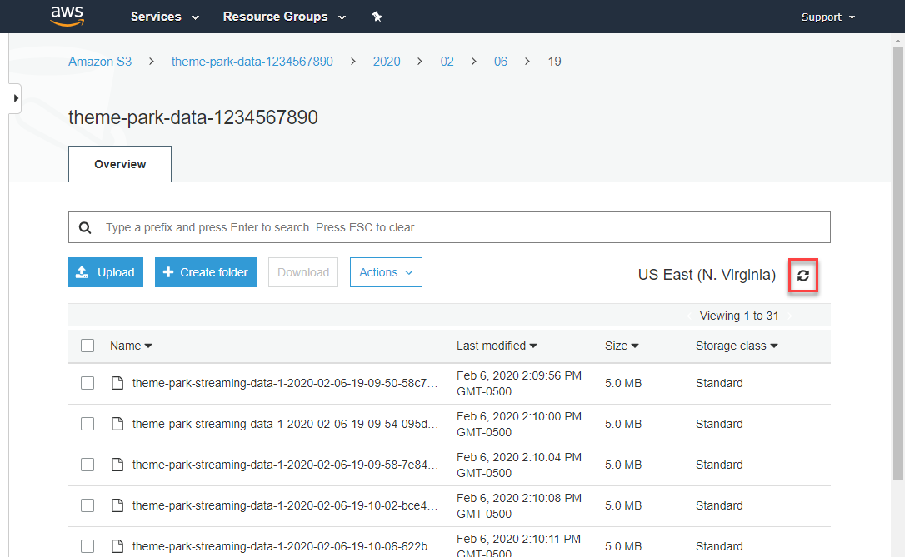

# Module 5: Analyzing visitor stats - (2) Deploy and run the simulator

*[Click here](../README.md) to return the main instructions for Module 5 at any time.*

To simulate the load expected from a full park of visitors, you will deploy a simulator. This is a custom application running in a Lambda function.

## How it works

* You will deploy the simulator application using SAM. The simulator runs in a Lambda function.
* The simulator generates approximately one million messages for between 70-80,000 visitors. On average, it produces 300Mb of streaming data. It will take ~5 minutes to simulate an entire 12-hour park day, streaming at an average 1000 transactions per second.
* These messages are sent to the Kinesis Firehose delivery stream you configured in the previous step. They will start appearing in the dedicated S3 bucket shortly after the simulator starts.
* A typical message is a JSON object - here is an example for a completed ride by a visitor:

```
{
    "event:": "Ride",
    "rideId": "ride-014",
    "rating": 4,
    "timestamp": "2020-02-25T20:59:33.184Z",
    "visitorId": 9,
    "visitor": {
        "id": 9,
        "firstName": "Kacie",
        "lastName": "Kahn",
        "age": 18,
        "birthday":                      
            "month": 7,
            "day": 25
        },
        "home": {
            "latitude": 42.058359409010635,
            "longitude": -90.28163047438535
        },
        "arrivalTime": "2020-02-25T20:20:16.787Z",
        "totalRides": 4
    }
}
```
## Deploy the simulator application

**:white_check_mark: Step-by-step Instructions**

1. Go back to your browser tab with Cloud9 running. If you need to re-launch Cloud9, from the AWS Management Console, select **Services** then select **Cloud9** under *Developer Tools*.

#### :star: Make sure your region is set to the same region you initially selected for Cloud9.

2. In the terminal, execute the following commands. First, change directory:

```
cd ~/environment/theme-park-backend/5-park-stats/2-simulator/sam-app
```
3. Now, build and deploy the SAM application:
```
sam build
sam package --output-template-file packaged.yaml --s3-bucket $s3_deploy_bucket
sam deploy --template-file packaged.yaml --stack-name theme-park-simulator --capabilities CAPABILITY_IAM
```
This will take a few minutes to deploy - wait for the confirmation message in the console before continuing.

4. Retrieve the name of the deployed Lambda function:

```
aws lambda list-functions | grep theme-park-simulator | grep FunctionName
```


5. Copy the name value to the clipboard (exclude the quotes). Now invoke the Lambda function:
```
aws lambda invoke --function-name ENTER_FUNCTION_NAME output.txt
```
6. The simulator is now running and takes 4-5 minutes to complete. Continue with the workshop without waiting.

## Observing the output in S3

**:white_check_mark: Step-by-step Instructions**

1. Go to the S3 console - from the AWS Management Console, select **Services** then select **S3** under *Storage*. **Make sure your region is correct.**

2. Select the bucket beginning with the name `theme-park-data` to view its contents. 

3. Click through the folders (year, month, day, hour) until reaching the sub-folder with the streaming data objects.



4. Click the refresh icon on this page while the simulation is running to see new objects as they are written to the bucket by Kinesis.

## Next steps

At this stage, the simulation is running and logging output to Kinesis. Your delivery stream is aggregating the data into the dedicated S3 bucket. Wait until the simulation finishes before continuing.

Next, you will analyze the data for business insights with Amazon QuickSight. To start the next section, [click here to continue](../3-quicksight/README.md).